# Distributed version of the Spring PetClinic Sample Application built with Spring Cloud and Spring AI

[](https://github.com/spring-petclinic/spring-petclinic-microservices/actions/workflows/maven-build.yml)
[](https://opensource.org/licenses/Apache-2.0)

This microservices branch was initially derived from [AngularJS version](https://github.com/spring-petclinic/spring-petclinic-angular1) to demonstrate how to split sample Spring application into [microservices](http://www.martinfowler.com/articles/microservices.html).
To achieve that goal, we use Spring Cloud Gateway, Spring Cloud Circuit Breaker, Spring Cloud Config, Micrometer Tracing, Resilience4j, Open Telemetry 
and the Eureka Service Discovery from the [Spring Cloud Netflix](https://github.com/spring-cloud/spring-cloud-netflix) technology stack.

[](https://codespaces.new/spring-petclinic/spring-petclinic-microservices)

[](https://app.codeanywhere.com/#https://github.com/spring-petclinic/spring-petclinic-microservices)

## Starting services locally without Docker

Every microservice is a Spring Boot application and can be started locally using IDE or `../mvnw spring-boot:run` command.
Please note that supporting services (Config and Discovery Server) must be started before any other application (Customers, Vets, Visits and API).
Startup of Tracing server, Admin server, Grafana and Prometheus is optional.
If everything goes well, you can access the following services at given location:
* Discovery Server - http://localhost:8761
* Config Server - http://localhost:8888
* AngularJS frontend (API Gateway) - http://localhost:8080
* Customers, Vets, Visits and GenAI Services - random port, check Eureka Dashboard 
* Tracing Server (Zipkin) - http://localhost:9411/zipkin/ (we use [openzipkin](https://github.com/openzipkin/zipkin/tree/main/zipkin-server))
* Admin Server (Spring Boot Admin) - http://localhost:9090
* Grafana Dashboards - http://localhost:3030
* Prometheus - http://localhost:9091

You can tell Config Server to use your local Git repository by using `native` Spring profile and setting
`GIT_REPO` environment variable, for example:
`-Dspring.profiles.active=native -DGIT_REPO=/projects/spring-petclinic-microservices-config`

## Starting services locally with docker-compose
In order to start entire infrastructure using Docker, you have to build images by executing
``bash
./mvnw clean install -P buildDocker
``
This requires `Docker` or `Docker desktop` to be installed and running.

Alternatively you can also build all the images on `Podman`, which requires Podman or Podman Desktop to be installed and running.
```bash
./mvnw clean install -PbuildDocker -Dcontainer.executable=podman
```
By default, the Docker OCI image is build for an `linux/amd64` platform.
For other architectures, you could change it by using the `-Dcontainer.platform` maven command line argument.
For instance, if you target container images for an Apple M2, you could use the command line with the `linux/arm64` architecture:
```bash
./mvnw clean install -P buildDocker -Dcontainer.platform="linux/arm64"
```

Once images are ready, you can start them with a single command
`docker compose up` or `podman-compose up`. 

Containers startup order is coordinated with the `service_healthy` condition of the Docker Compose [depends-on](https://github.com/compose-spec/compose-spec/blob/main/spec.md#depends_on) expression 
and the [healthcheck](https://github.com/compose-spec/compose-spec/blob/main/spec.md#healthcheck) of the service containers. 
After starting services, it takes a while for API Gateway to be in sync with service registry,
so don't be scared of initial Spring Cloud Gateway timeouts. You can track services availability using Eureka dashboard
available by default at http://localhost:8761.

The `main` branch uses an Eclipse Temurin with Java 17 as Docker base image.

*NOTE: Under MacOSX or Windows, make sure that the Docker VM has enough memory to run the microservices. The default settings
are usually not enough and make the `docker-compose up` painfully slow.*


## Starting services locally with docker-compose and Java
If you experience issues with running the system via docker-compose you can try running the `./scripts/run_all.sh` script that will start the infrastructure services via docker-compose and all the Java based applications via standard `nohup java -jar ...` command. The logs will be available under `${ROOT}/target/nameoftheapp.log`. 

Each of the java based applications is started with the `chaos-monkey` profile in order to interact with Spring Boot Chaos Monkey. You can check out the (README)[scripts/chaos/README.md] for more information about how to use the `./scripts/chaos/call_chaos.sh` helper script to enable assaults.

## Understanding the Spring Petclinic application

[See the presentation of the Spring Petclinic Framework version](http://fr.slideshare.net/AntoineRey/spring-framework-petclinic-sample-application)

[A blog post introducing the Spring Petclinic Microsevices](http://javaetmoi.com/2018/10/architecture-microservices-avec-spring-cloud/) (french language)

You can then access petclinic here: http://localhost:8080/

## Microservices Overview

This project consists of several microservices:
- **Customers Service**: Manages customer data.
- **Vets Service**: Handles information about veterinarians.
- **Visits Service**: Manages pet visit records.
- **GenAI Service**: Provides a chatbot interface to the application.
- **API Gateway**: Routes client requests to the appropriate services.
- **Config Server**: Centralized configuration management for all services.
- **Discovery Server**: Eureka-based service registry.

Each service has its own specific role and communicates via REST APIs.


**Architecture diagram of the Spring Petclinic Microservices**

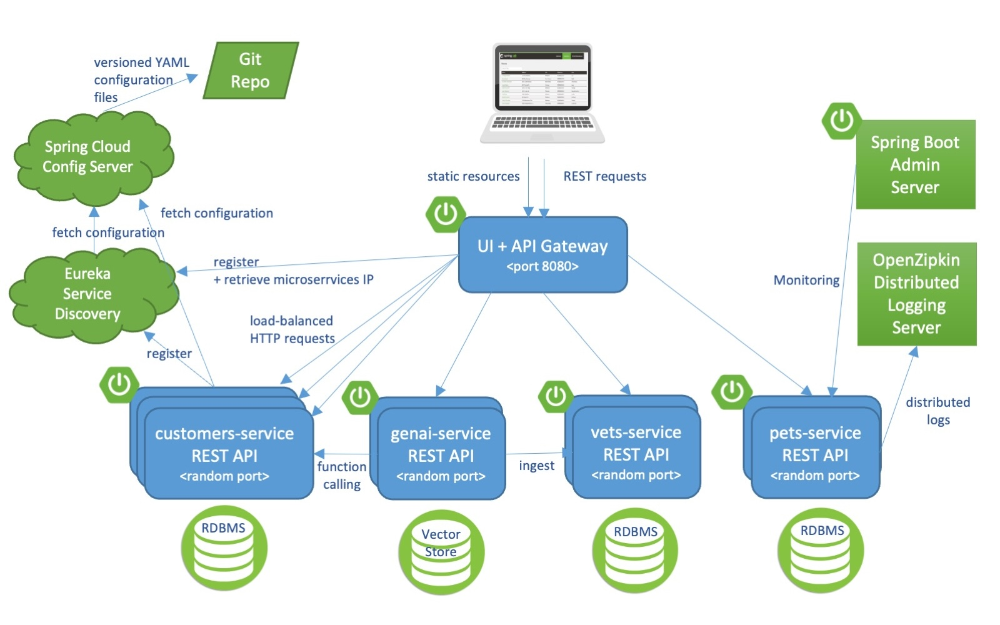

## Integrating the Spring AI Chatbot

Spring Petclinic integrates a Chatbot that allows you to interact with the application in a natural language. Here are some examples of what you could ask:

1. Please list the owners that come to the clinic.
2. Are there any vets that specialize in surgery?
3. Is there an owner named Betty?
4. Which owners have dogs?
5. Add a dog for Betty. Its name is Moopsie.
6. Create a new owner.

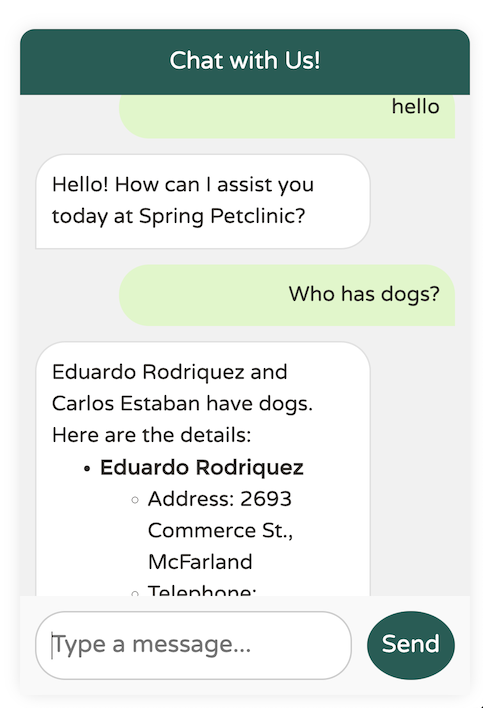

This `spring-petlinic-genai-service` microservice currently supports **OpenAI** (default) or **Azure's OpenAI** as the LLM provider.
In order to start the microservice, perform the following steps:

1. Decide which provider you want to use. By default, the `spring-ai-starter-model-openai` dependency is enabled. 
   You can change it to `spring-ai-starter-model-azure-openai`in the `pom.xml`.
2. Create an OpenAI API key or a Azure OpenAI resource in your Azure Portal.
   Refer to the [OpenAI's quickstart](https://platform.openai.com/docs/quickstart) or [Azure's documentation](https://learn.microsoft.com/en-us/azure/ai-services/openai/) for further information on how to obtain these.
   You only need to populate the provider you're using - either openai, or azure-openai.
   If you don't have your own OpenAI API key, don't worry!
   You can temporarily use the `demo` key, which OpenAI provides free of charge for demonstration purposes.
   This `demo` key has a quota, is limited to the `gpt-4o-mini` model, and is intended solely for demonstration use.
   With your own OpenAI account, you can test the `gpt-4o` model by modifying the `deployment-name` property of the `application.yml` file.
3. Export your API keys and endpoint as environment variables:
    * either OpenAI:
    ```bash
    export OPENAI_API_KEY="your_api_key_here"
    ```
    * or Azure OpenAI:
    ```bash
    export AZURE_OPENAI_ENDPOINT="https://your_resource.openai.azure.com"
    export AZURE_OPENAI_KEY="your_api_key_here"
    ```

## In case you find a bug/suggested improvement for Spring Petclinic Microservices

Our issue tracker is available here: https://github.com/spring-petclinic/spring-petclinic-microservices/issues

## Database configuration

In its default configuration, Petclinic uses an in-memory database (HSQLDB) which gets populated at startup with data.
A similar setup is provided for MySql in case a persistent database configuration is needed.
Dependency for Connector/J, the MySQL JDBC driver is already included in the `pom.xml` files.

### Start a MySql database

You may start a MySql database with docker:

```
docker run -e MYSQL_ROOT_PASSWORD=petclinic -e MYSQL_DATABASE=petclinic -p 3306:3306 mysql:8.4.5
```
or download and install the MySQL database (e.g., MySQL Community Server 8.4.5 LTS), which can be found here: https://dev.mysql.com/downloads/

### Use the Spring 'mysql' profile

To use a MySQL database, you have to start 3 microservices (`visits-service`, `customers-service` and `vets-services`)
with the `mysql` Spring profile. Add the `--spring.profiles.active=mysql` as program argument.

By default, at startup, database schema will be created and data will be populated.
You may also manually create the PetClinic database and data by executing the `"db/mysql/{schema,data}.sql"` scripts of each 3 microservices. 
In the `application.yml` of the [Configuration repository], set the `initialization-mode` to `never`.

If you are running the microservices with Docker, you have to add the `mysql` profile into the (Dockerfile)[docker/Dockerfile]:
```
ENV SPRING_PROFILES_ACTIVE docker,mysql
```
In the `mysql section` of the `application.yml` from the [Configuration repository], you have to change 
the host and port of your MySQL JDBC connection string. 

## Custom metrics monitoring

Grafana and Prometheus are included in the `docker-compose.yml` configuration, and the public facing applications
have been instrumented with [MicroMeter](https://micrometer.io) to collect JVM and custom business metrics.

A JMeter load testing script is available to stress the application and generate metrics: [petclinic_test_plan.jmx](spring-petclinic-api-gateway/src/test/jmeter/petclinic_test_plan.jmx)


### Using Prometheus

* Prometheus can be accessed from your local machine at http://localhost:9091

### Using Grafana with Prometheus

* An anonymous access and a Prometheus datasource are setup.
* A `Spring Petclinic Metrics` Dashboard is available at the URL http://localhost:3030/d/69JXeR0iw/spring-petclinic-metrics.
You will find the JSON configuration file here: [docker/grafana/dashboards/grafana-petclinic-dashboard.json]().
* You may create your own dashboard or import the [Micrometer/SpringBoot dashboard](https://grafana.com/dashboards/4701) via the Import Dashboard menu item.
The id for this dashboard is `4701`.

### Custom metrics
Spring Boot registers a lot number of core metrics: JVM, CPU, Tomcat, Logback... 
The Spring Boot auto-configuration enables the instrumentation of requests handled by Spring MVC.
All those three REST controllers `OwnerResource`, `PetResource` and `VisitResource` have been instrumented by the `@Timed` Micrometer annotation at class level.

* `customers-service` application has the following custom metrics enabled:
  * @Timed: `petclinic.owner`
  * @Timed: `petclinic.pet`
* `visits-service` application has the following custom metrics enabled:
  * @Timed: `petclinic.visit`

## Looking for something in particular?

| Spring Cloud components         | Resources  |
|---------------------------------|------------|
| Configuration server            | [Config server properties](spring-petclinic-config-server/src/main/resources/application.yml) and [Configuration repository] |
| Service Discovery               | [Eureka server](spring-petclinic-discovery-server) and [Service discovery client](spring-petclinic-vets-service/src/main/java/org/springframework/samples/petclinic/vets/VetsServiceApplication.java) |
| API Gateway                     | [Spring Cloud Gateway starter](spring-petclinic-api-gateway/pom.xml) and [Routing configuration](/spring-petclinic-api-gateway/src/main/resources/application.yml) |
| Docker Compose                  | [Spring Boot with Docker guide](https://spring.io/guides/gs/spring-boot-docker/) and [docker-compose file](docker-compose.yml) |
| Circuit Breaker                 | [Resilience4j fallback method](spring-petclinic-api-gateway/src/main/java/org/springframework/samples/petclinic/api/boundary/web/ApiGatewayController.java)  |
| Grafana / Prometheus Monitoring | [Micrometer implementation](https://micrometer.io/), [Spring Boot Actuator Production Ready Metrics] |

|  Front-end module | Files |
|-------------------|-------|
| Node and NPM      | [The frontend-maven-plugin plugin downloads/installs Node and NPM locally then runs Bower and Gulp](spring-petclinic-ui/pom.xml)  |
| Bower             | [JavaScript libraries are defined by the manifest file bower.json](spring-petclinic-ui/bower.json)  |
| Gulp              | [Tasks automated by Gulp: minify CSS and JS, generate CSS from LESS, copy other static resources](spring-petclinic-ui/gulpfile.js)  |
| Angular JS        | [app.js, controllers and templates](spring-petclinic-ui/src/scripts/)  |

## Pushing to a Docker registry

Docker images for `linux/amd64` and `linux/arm64` platforms have been published into DockerHub 
in the [springcommunity](https://hub.docker.com/u/springcommunity) organization.
You can pull an image:
```bash
docker pull springcommunity/spring-petclinic-config-server
```
You may prefer to build then push images to your own Docker registry.

### Choose your Docker registry

You need to define your target Docker registry.
Make sure you're already logged in by running `docker login <endpoint>` or `docker login` if you're just targeting Docker hub.

Setup the `REPOSITORY_PREFIX` env variable to target your Docker registry.
If you're targeting Docker hub, simple provide your username, for example:
```bash
export REPOSITORY_PREFIX=springcommunity
```

For other Docker registries, provide the full URL to your repository, for example:
```bash
export REPOSITORY_PREFIX=harbor.myregistry.com/petclinic
```

To push Docker image for the `linux/amd64` and the `linux/arm64` platform to your own registry, please use the command line:
```bash
mvn clean install -Dmaven.test.skip -P buildDocker -Ddocker.image.prefix=${REPOSITORY_PREFIX} -Dcontainer.build.extraarg="--push" -Dcontainer.platform="linux/amd64,linux/arm64"
```

The `scripts/pushImages.sh` and `scripts/tagImages.sh` shell scripts could also be used once you build your image with the `buildDocker` maven profile.
The `scripts/tagImages.sh` requires to declare the `VERSION` env variable.

## Compiling the CSS

There is a `petclinic.css` in `spring-petclinic-api-gateway/src/main/resources/static/css`.
It was generated from the `petclinic.scss` source, combined with the [Bootstrap](https://getbootstrap.com/) library.
If you make changes to the `scss`, or upgrade Bootstrap, you will need to re-compile the CSS resources
using the Maven profile `css` of the `spring-petclinic-api-gateway`module.
```bash
cd spring-petclinic-api-gateway
mvn generate-resources -P css
```

## Interesting Spring Petclinic forks

The Spring Petclinic `main` branch in the main [spring-projects](https://github.com/spring-projects/spring-petclinic)
GitHub org is the "canonical" implementation, currently based on Spring Boot and Thymeleaf.

This [spring-petclinic-microservices](https://github.com/spring-petclinic/spring-petclinic-microservices/) project is one of the [several forks](https://spring-petclinic.github.io/docs/forks.html) 
hosted in a special GitHub org: [spring-petclinic](https://github.com/spring-petclinic).
If you have a special interest in a different technology stack
that could be used to implement the Pet Clinic then please join the community there.


## Contributing

The [issue tracker](https://github.com/spring-petclinic/spring-petclinic-microservices/issues) is the preferred channel for bug reports, features requests and submitting pull requests.

For pull requests, editor preferences are available in the [editor config](.editorconfig) for easy use in common text editors. Read more and download plugins at <http://editorconfig.org>.


[Configuration repository]: https://github.com/spring-petclinic/spring-petclinic-microservices-config
[Spring Boot Actuator Production Ready Metrics]: https://docs.spring.io/spring-boot/docs/current/reference/html/production-ready-metrics.html

## Supported by

[](https://jb.gg/OpenSourceSupport)


---

# 🐾 Spring PetClinic Microservices — G11 Production Deployment


## 🌐 Live Production URL
**[https://gregddevops.com.ng](https://gregddevops.com.ng)**

---

## 👤 Project Details

| Item | Value |
|------|-------|
| **Project Name** | Spring PetClinic Microservices |
| **Team** | Achievers11 — Group 11 |
| **GitHub Username** | gregodprogrammer |
| **Jira Project** | GPM (Achievers11 - PetClinic Microservices) |
| **AWS Region** | af-south-1 (Africa — Cape Town) |
| **Production URL** | https://gregddevops.com.ng |
| **Source Project** | spring-petclinic/spring-petclinic-microservices |

---

## 🏗️ Architecture Overview

```
Internet
    │
    ▼
Route 53 (gregddevops.com.ng)
    │
    ▼
AWS ALB (Application Load Balancer)
    │  SSL Termination (ACM Certificate)
    │  HTTP → HTTPS Redirect
    ▼
EKS Cluster (petclinic-cluster) — af-south-1
    │
    ├── petclinic-staging namespace
    │       ├── config-server      :8888
    │       ├── discovery-server   :8761 (Eureka)
    │       ├── api-gateway        :8080 ← ALB routes here
    │       ├── customers-service  :8081
    │       ├── visits-service     :8082
    │       ├── vets-service       :8083
    │       └── genai-service      (OpenAI powered AI chat)
    │
    └── monitoring namespace
            ├── prometheus         :9091
            ├── grafana            :3030
            └── zipkin             :9411
```

---

## 🛠️ Tech Stack

| Category | Technology |
|----------|-----------|
| **Language** | Java 17 (OpenJDK) |
| **Framework** | Spring Boot 3.x, Spring Cloud |
| **Build Tool** | Apache Maven 3.6.3 |
| **Containerisation** | Docker 29.4.2 |
| **Container Registry** | AWS ECR (af-south-1) |
| **Orchestration** | Kubernetes (EKS v1.36) |
| **Package Manager** | Helm v3.20.2 |
| **CI/CD** | GitHub Actions |
| **Service Discovery** | Netflix Eureka |
| **API Gateway** | Spring Cloud Gateway |
| **Distributed Tracing** | Zipkin |
| **Monitoring** | Prometheus + Grafana |
| **AI Chat** | OpenAI GPT-4o-mini (GenAI Service) |
| **SSL** | AWS ACM (auto-renewing) |
| **DNS** | AWS Route 53 |
| **Load Balancer** | AWS ALB (via Ingress Controller) |
| **Secrets** | AWS Secrets Manager + K8s Secrets |

---

## 📋 Prerequisites

| Tool | Version Used |
|------|-------------|
| Java JDK | 17.0.18 |
| Apache Maven | 3.6.3 |
| Docker | 29.4.2 |
| kubectl | v1.36.0 |
| eksctl | 0.226.0 |
| Helm | v3.20.2 |
| AWS CLI | 2.34.4 |
| Git | 2.34.1 |

---

## 🚀 Deployment Guide — All 8 Phases

---

## Phase 1 — Install All Tools on Ubuntu

```bash
# Java 17
sudo apt update
sudo apt install -y openjdk-17-jdk
java -version

# Maven
sudo apt install -y maven
mvn -version

# Docker
sudo apt install -y docker.io
sudo systemctl start docker
sudo usermod -aG docker $USER
docker --version

# AWS CLI
curl "https://awscli.amazonaws.com/awscli-exe-linux-x86_64.zip" -o "awscliv2.zip"
unzip awscliv2.zip
sudo ./aws/install
aws --version

# kubectl
curl -LO "https://dl.k8s.io/release/$(curl -L -s https://dl.k8s.io/release/stable.txt)/bin/linux/amd64/kubectl"
sudo install -o root -g root -m 0755 kubectl /usr/local/bin/kubectl
kubectl version --client

# eksctl
curl --silent --location \
  "https://github.com/eksctl-io/eksctl/releases/latest/download/eksctl_$(uname -s)_amd64.tar.gz" \
  | tar xz -C /tmp
sudo mv /tmp/eksctl /usr/local/bin
eksctl version

# Helm
curl https://raw.githubusercontent.com/helm/helm/main/scripts/get-helm-3 | bash
helm version

# Git
sudo apt install -y git
git --version
```

### ✅ Verify All Tools
```bash
echo "=== Java ===" && java -version 2>&1
echo "=== Maven ===" && mvn -version 2>&1
echo "=== Docker ===" && docker --version 2>&1
echo "=== kubectl ===" && kubectl version --client 2>&1
echo "=== eksctl ===" && eksctl version 2>&1
echo "=== Helm ===" && helm version 2>&1
echo "=== AWS CLI ===" && aws --version 2>&1
echo "=== Git ===" && git --version 2>&1
```

### 📸 Evidence
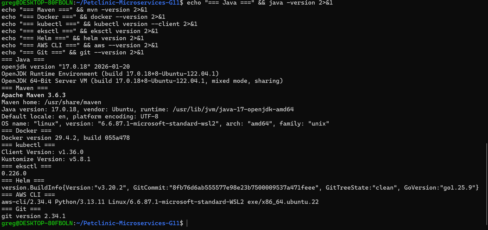

---

## Phase 2 — AWS Setup

### Step 1 — Configure AWS CLI
```bash
aws configure
# Enter:
# AWS Access Key ID: YOUR_ACCESS_KEY
# AWS Secret Access Key: YOUR_SECRET_KEY
# Default region: af-south-1
# Default output format: json
```

### Step 2 — Get Your AWS Account ID
```bash
aws sts get-caller-identity
```

### 📸 Evidence
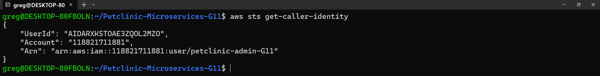

### Step 3 — Create ECR Repositories
```bash
for service in config-server discovery-server api-gateway \
  customers-service vets-service visits-service genai-service; do
  aws ecr create-repository \
    --repository-name spring-petclinic-$service \
    --region af-south-1
done
```

### Step 4 — Verify ECR Repositories
```bash
aws ecr describe-repositories \
  --region af-south-1 \
  --query 'repositories[*].repositoryName' \
  --output table
```

### 📸 Evidence
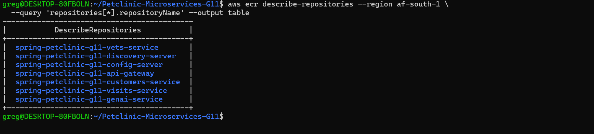

---

## Phase 3 — Clone Project and Setup

```bash
git clone https://github.com/spring-petclinic/spring-petclinic-microservices.git
cd spring-petclinic-microservices
mkdir -p ~/Petclinic-Microservices-G11/screenshots
```

---

## Phase 4 — Run Locally with Docker Compose

```bash
# Build Docker Images
./mvnw clean install -P buildDocker -DskipTests

# Start All Services
docker compose up -d

# Verify
docker compose ps
```

### Local URLs
| Service | URL |
|---------|-----|
| App | http://localhost:8080 |
| Eureka | http://localhost:8761 |
| Zipkin | http://localhost:9411 |
| Grafana | http://localhost:3030 |
| Prometheus | http://localhost:9091 |

---

## Phase 5 — GitHub Repository and CI/CD

### GitHub Secrets Required
| Secret Name | Description |
|-------------|-------------|
| `AWS_ACCESS_KEY_ID` | AWS IAM user access key |
| `AWS_SECRET_ACCESS_KEY` | AWS IAM user secret key |
| `AWS_ACCOUNT_ID` | 12-digit AWS account number |
| `OPENAI_API_KEY` | OpenAI API key for GenAI service |

---

## Phase 6 — EKS Cluster and Kubernetes Deployment

### Step 1 — Create EKS Cluster
```bash
eksctl create cluster \
  --name petclinic-cluster \
  --region af-south-1 \
  --nodegroup-name petclinic-workers \
  --node-type t3.medium \
  --nodes 3 \
  --managed
```
⏱️ Takes 15-20 minutes

### Step 2 — Connect kubectl
```bash
aws eks update-kubeconfig \
  --region af-south-1 \
  --name petclinic-cluster
```

### 📸 Evidence — kubectl Connected
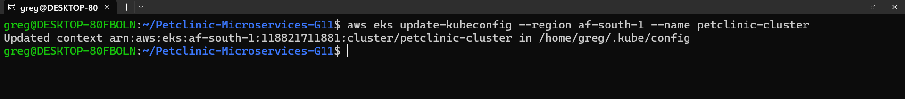

### Step 3 — Deploy via Helm
```bash
helm install petclinic ./helm/petclinic \
  --namespace petclinic-staging \
  --set image.tag=latest
```

### Step 4 — Verify All Pods Running
```bash
kubectl get pods -n petclinic-staging
```

### 📸 Evidence — All Pods Running
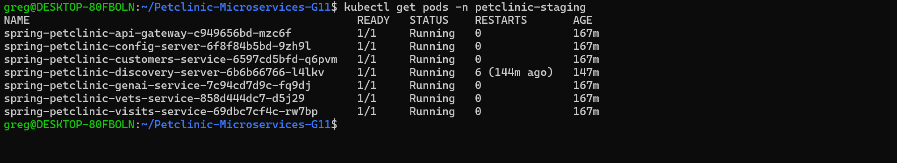

### 📸 Evidence — All Services
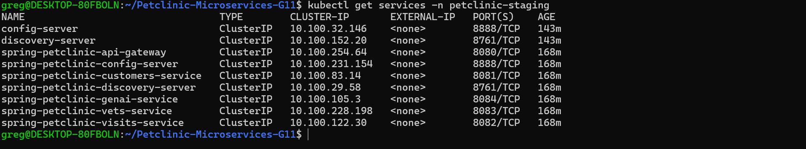

### 📸 Evidence — Ingress Status
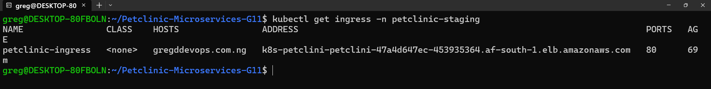

---

## Phase 7 — OpenAI GenAI Service Setup

```bash
# Store key in AWS Secrets Manager
aws secretsmanager create-secret \
  --name petclinic/openai-api-key \
  --secret-string "sk-your-openai-key-here" \
  --region af-south-1

# Create Kubernetes Secret
OPENAI_KEY=$(aws secretsmanager get-secret-value \
  --secret-id petclinic/openai-api-key \
  --query SecretString \
  --output text \
  --region af-south-1)

kubectl create secret generic genai-secret \
  --from-literal=OPENAI_API_KEY=$OPENAI_KEY \
  -n petclinic-staging
```

### 📸 Evidence — OpenAI Secret in AWS
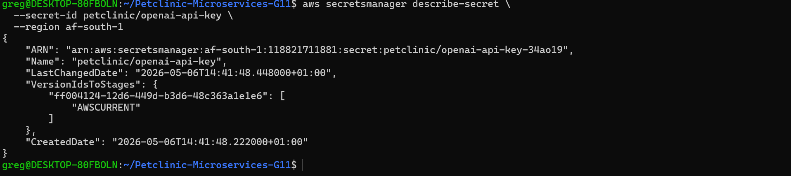

---

## Phase 8 — Domain Name and HTTPS

### Step 1 — Request ACM SSL Certificate
```bash
aws acm request-certificate \
  --domain-name gregddevops.com.ng \
  --validation-method DNS \
  --region af-south-1
```

### Step 2 — Get CNAME Validation Record
```bash
aws acm describe-certificate \
  --certificate-arn YOUR_CERT_ARN \
  --region af-south-1 \
  --query 'Certificate.DomainValidationOptions[0].ResourceRecord'
```

### Step 3 — Add CNAME to DNS Provider (WhoGoHost)
Contact DNS provider and request they add the CNAME record returned above.

### Step 4 — Wait for Certificate Issued
```bash
aws acm describe-certificate \
  --certificate-arn YOUR_CERT_ARN \
  --region af-south-1 \
  --query 'Certificate.Status'
```

### 📸 Evidence — ACM Certificate Issued
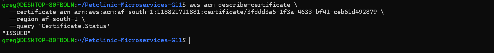

### Step 5 — Get ALB Address
```bash
kubectl get ingress -n petclinic-staging
```

### 📸 Evidence — Ingress ALB Address
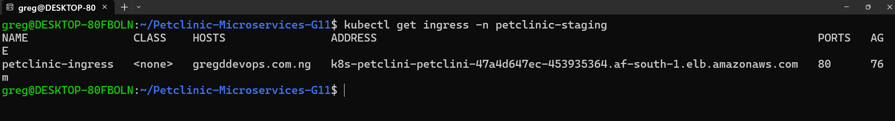

### Step 6 — Check Route 53 Hosted Zone
```bash
aws route53 list-hosted-zones \
  --query 'HostedZones[*].[Name,Id]' \
  --output table
```

### 📸 Evidence — Route 53 Hosted Zone
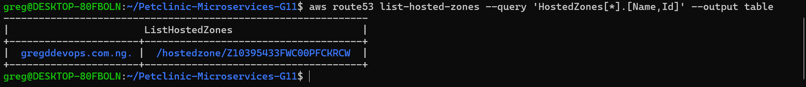

### Step 7 — View Ingress YAML Configuration
```bash
cat helm/petclinic/templates/ingress.yaml
```

### 📸 Evidence — Ingress YAML
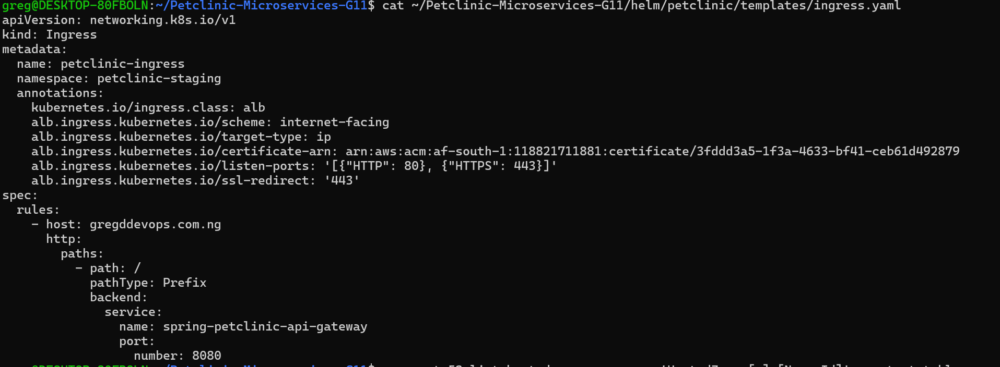

### Step 8 — Create Route 53 A Record
```bash
aws route53 change-resource-record-sets \
  --hosted-zone-id Z10395433FWC00PFCKRCW \
  --change-batch '{
    "Changes": [{
      "Action": "UPSERT",
      "ResourceRecordSet": {
        "Name": "gregddevops.com.ng",
        "Type": "A",
        "AliasTarget": {
          "HostedZoneId": "Z268VQBMOI5EKX",
          "DNSName": "YOUR_ALB_HOSTNAME.af-south-1.elb.amazonaws.com",
          "EvaluateTargetHealth": true
        }
      }
    }]
  }'
```

### 📸 Evidence — Route 53 A Record Created
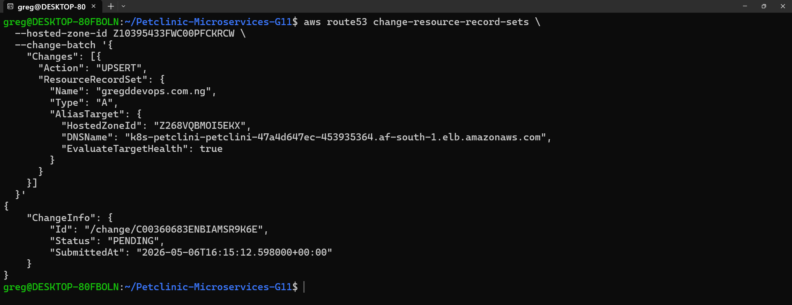

### Step 9 — Verify DNS Propagation
```bash
nslookup gregddevops.com.ng
```

### 📸 Evidence — DNS Propagated
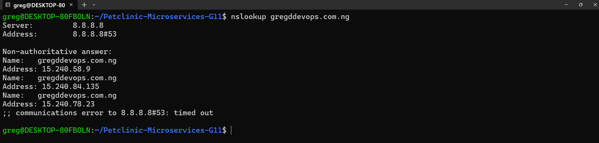

### Step 10 — Verify HTTPS is Live
```bash
curl -I https://gregddevops.com.ng
```

### 📸 Evidence — HTTPS Curl Response
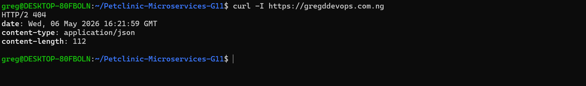

### 📸 Evidence — All Pods Running After HTTPS
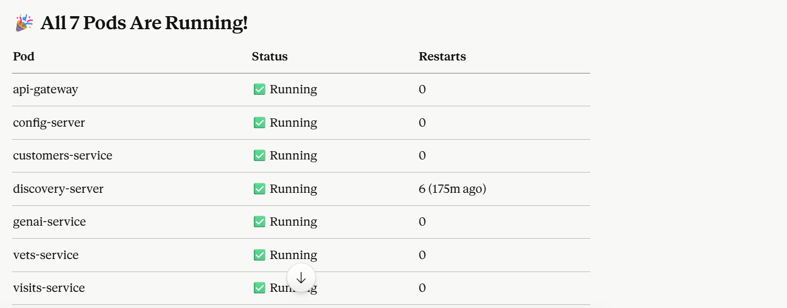

### 📸 Evidence — API Gateway Logs
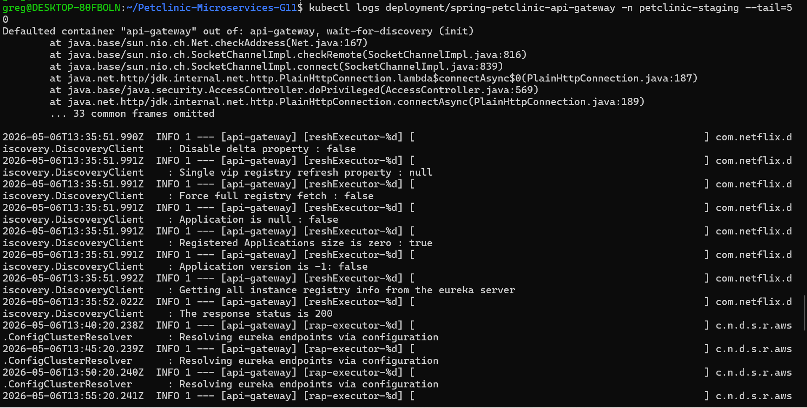

### 📸 Evidence — Website HTML Response
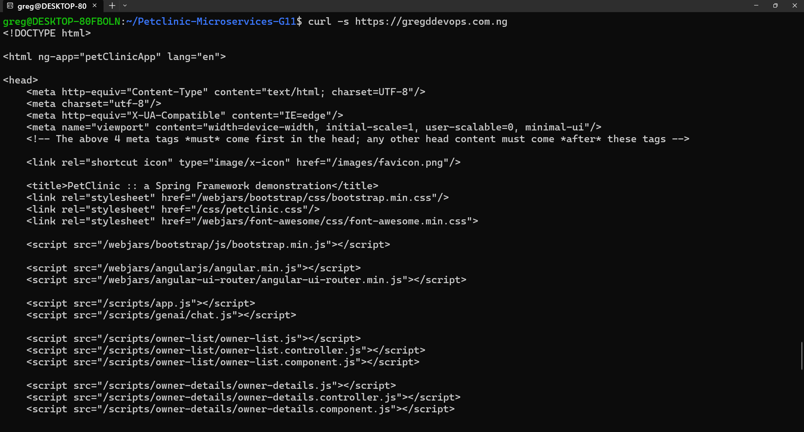

### 📸 Evidence — Live HTTPS Website
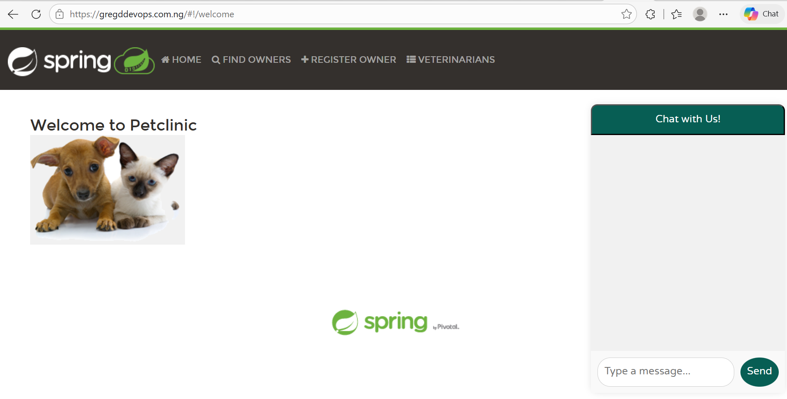

---

## 🔧 Useful Commands

### Session Start — Run Every Time
```bash
aws eks update-kubeconfig --region af-south-1 --name petclinic-cluster
kubectl get pods -n petclinic-staging
kubectl get ingress -n petclinic-staging
```

### Troubleshooting
```bash
# View pod logs
kubectl logs [pod-name] -n petclinic-staging

# Describe pod
kubectl describe pod [pod-name] -n petclinic-staging

# Restart a service
kubectl rollout restart deployment [service-name] -n petclinic-staging
```

### Helm Commands
```bash
# Install
helm install petclinic ./helm/petclinic \
  --namespace petclinic-staging --set image.tag=latest

# Upgrade
helm upgrade petclinic ./helm/petclinic \
  --namespace petclinic-staging --set image.tag=latest

# Uninstall
helm uninstall petclinic --namespace petclinic-staging
```

---

## 💰 Cost Management

| Resource | Cost/Hour |
|----------|-----------|
| EKS Control Plane | $0.10 |
| 3x t3.medium nodes | $0.144 |
| ALB Load Balancer | $0.008 |
| **Total** | **~$0.252/hr** |

### Delete Cluster When Not in Use
```bash
eksctl delete cluster --name petclinic-cluster --region af-south-1
```

### Recreate Cluster
```bash
eksctl create cluster \
  --name petclinic-cluster \
  --region af-south-1 \
  --nodegroup-name petclinic-workers \
  --node-type t3.medium \
  --nodes 3
```

**What survives cluster deletion:**
- ✅ ECR Docker images
- ✅ AWS Secrets Manager
- ✅ Route 53 DNS records
- ✅ ACM SSL Certificate
- ✅ GitHub repository and code

---

## 🔐 Security

- All AWS credentials stored as **GitHub Secrets** — never hardcoded
- OpenAI API key stored in **AWS Secrets Manager**
- Kubernetes secrets used for sensitive runtime config
- HTTPS enforced — HTTP automatically redirects to HTTPS

---

## 👥 Team

| Role | Name |
|------|------|
| DevOps Engineer | Odi Chibuzor Greg |
| Scrum Master | Idah Makena |
| Team | Achievers11 — Group 11 |

---

*Last updated: 2026-05-07 | Region: af-south-1 | Cluster: petclinic-cluster*
